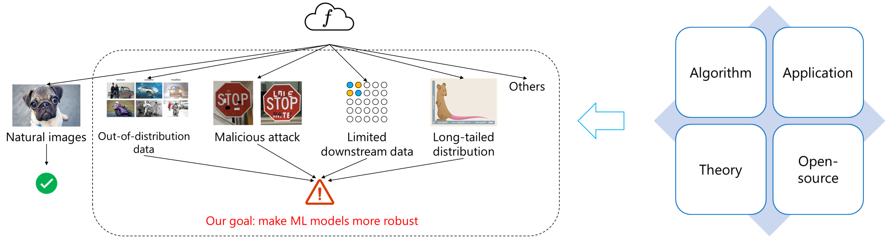

<!-- 

 -->

#### **Transform Stencil Computation to Matrix Multiplication on Tensor Cores (Bridging the Gap Between Stencil and Convolution)**
Advisor: Dr. Kun Li | Microsoft Research Asia

We proposed ConvStencil, a novel stencil computing system designed to efficiently transform stencil computation to matrix multiplication on Tensor Cores. This project analyzed the similarities and differences between stencils and convolutions and optimized them for acceleration on GPUs based on the characteristics of GPU hardware. 
- Inspired by GEMM-based convolution and im2col, we proposed stencil2row layout transformation which significantly saves memory footprint by over 70%.
- Proposed dual tessellation algorithm which increases Tensor Core utilization from 12.5% to 87.5%.
- Proposed ditry bits padding to reduce bank conflicts and branch diverges, improving the performance by 21.4%.
- **[Submitted to PPoPP]** ConvStencil: Transform Stencil Computation to Matrix Multiplication on Tensor Cores. Yuetao Chen, Kun Li*, Yuhao Wang, Donglin Bai, Lei Wang, Lingxiao Ma, Liang Yuan, Yunquan Zhang, Ting Cao, Mao Yang.

#### **Stencil Computing on Heterogeneous Platform**
Advisor: Dr. Kun Li | Microsoft Research Asia

It is the first system for high-performance Stencil on heterogeneous CPU+GPU with novel optimizations on both CPU and GPU. It leverages Pattern Mapping by Register-level Tetrominoes to efficiently utilize SIMD on CPUs and Tensor Cores on GPUs. It also leverages locality by cache/SMEM-level tetrominoes and implement CPU and GPU Collaboration.

- Implemented a new CPU SIMD register level algorithm for stencil computing, resulting in significant performance improvements of 6.3% - 19.9% on different stencil kernel shapes.
- Replicated the tessellate tiling (SC '17) to be coordinated with SIMD algorithm.
- Designed a data exchange method between CPU and GPU for stencil computation which covers the communication latency by computation.
- Proposed a disruptive vectorization design to relieve data alignment conflicts.

- **[arXiv (submitted to HPCA)] [Gamify Stencil Dwarf on Cloud for Democratizing Scientific Computing](https://arxiv.org/pdf/2303.08365.pdf)**. Kun Li, Zhichun Li, Yuetao Chen, Zixuan Wang, Yiwei Zhang, Liang Yuan, Haipeng Jia, Yunquan Zhang, Ting Cao*, Mao Yang.
- **[Submitted to PPoPP] Jigsaw: Toward Conflict-free Vectorized Stencil Computation by Tessellating Swizzled Registers**. Yiwei Zhang, Kun Li*, Liang Yuan, Yuetao Chen, Haipeng Jia, Yunquan Zhang, Ting Cao.

#### **Mobile Platform Resource Scheduling**
Advisor: Prof. Lei Liu | Institute of Computing Technology, Chinese Academy of Sciences

It is called MobiRL, a reinforcement learning-based resource scheduler for mobile systems.  It uses a DDPG model to dynamically adjust the upper and lower frequency limits of the CPU's different clusters and the GPU on mobile devices, in order to achieve the effect of simultaneously reducing frame loss rate and power consumption.

- Implemented a resource scheduling framework for Android devices using the Deep Deterministic Policy Gradient (DDPG) model to optimize performance.
- Designed a piecewise reward function that optimizes energy consumption while limiting frame loss rate, ensuring both efficient use of resources and a high-quality user experience.

#### **Intelligent Resource Scheduling for Co-located Services**
Advisor: Prof. Lei Liu | Institute of Computing Technology, Chinese Academy of Sciences

It is called OSML which employs multiple ML models to work collaboratively to predict QoS variations, shepherd the scheduling, and recover from QoS violations in complicated co-location services. Experimental results show that OSML supports higher loads and meets QoS targets with lower scheduling overheads and shorter convergence time than previous studies.

- Divided the DQN model into two parts to prevent incorrect scheduling decisions and ensure the QoS.
- Designed a resource sharing policy, such as shared cacheline, to optimize resource utilization across co-located services.
- Tuned PARTIES (ASPLOS '19) and CLITE (HPCA '20) for the evaluation and collected and annotated program resource allocation data.
- **[FAST 2023] [Intelligent Resource Scheduling for Co-located Latency-critical Services: A Multi-Model Collaborative Learning Approach](https://www.usenix.org/conference/fast23/presentation/liu)**. Lei Liu*, Xinglei Dou, Yuetao Chen.

#### **NVM‑aware thread scheduling approach on NUMA systems**
Advisor: Prof. Lei Liu | Institute of Computing Technology, Chinese Academy of Sciences

It is an NVM-aware thread scheduling approach for NUMA systems with hybrid memory, utilizing the LinUCB algorithm to guide scheduling decisions and reduce program execution time by up to 59.9\%.

- Found the significant difference in local and remote access bandwidth between NVM and DRAM led to performance loss for existing schedulers.
- Carefully selected appropriate features and used LinUCB to guide thread scheduling, resulting in improved performance.
- **[CCF THPC] [Smart Scheduler: an Adaptive NVM-Aware Thread Scheduling Approach on NUMA Systems](https://link.springer.com/article/10.1007/s42514-022-00110-2)**. <u>Yuetao Chen</u>, Keni Qiu, Li Chen, Haipeng Jia, Yunquan Zhang, Limin Xiao, Lei Liu*.

#### **Fast Fourier Transforms Library**
Advisor: Prof. Haipeng Jia | Institute of Computing Technology, Chinese Academy of Sciences

- Discovered the changing pattern of FFT algorithm with base 2.
- Automatically generated C language codes for FFT algorithm with base 2.